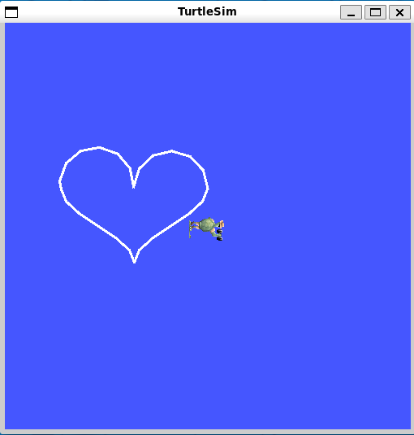

# turtlesim_teleop_python
A ROS2 TurtleSim  Python Controller similar to turtle_teleop_key, but
using python turtle command scripts for controlling instead of key strokes.

Running this example wiill result in the following output:


Read the [ROS2 turtlesim Tutorial](https://docs.ros.org/en/jazzy/Tutorials/Beginner-CLI-Tools/Introducing-Turtlesim/Introducing-Turtlesim.html)
if you are unfamiliar with this evironment.

The following Python turtle commands are supported. See the 
[Python Turtle](https://docs.python.org/3/library/turtle.html) page for command
details.

* Movement

        forward(), backward(), right(), left(), goto(), setpos(), teleport(), setx(),
        sety(), setheading(), home(), circle()

* State

        position(), towards(), xcor(), ycor(), heading(), distance(), clear()

* Pen Control
 
         pendown(), penup()


## Installation and Running as ROS2 package

1. Clone this repository into a ROS2 workspace src folder
2. Build workspace with `colcon build` followed by `source install/local_setup.bash`
3. In another terminal launch the turtlesim package as described in the ROS2 Tutorial

        sudo apt install ros-$ROS_DISTRO-turtlesim
        ros2 run turtlesim turtlesim_node

3. Run this package from the workspace with

        ros2 run turtlesim_teleop_python pythonop_turtle

## Parameter

The package provides the following custom parameters:

| Parameter     | Type  |Description                                       | Default |
|---------------|-------|--------------------------------------------------| --------|
| delay         | float | Delay between sending update messages in seconds.|  1.0    |
| scale_angular | float | Scale factor for angular movements.              |  1.0    |
| scale_linear  | float | Scale factor for linear movements.               |  1.0    |


## Interactive Usage

Interactive testing is working by going into 
`turtlesim_teleop_python/turtlesim_teleop_python` folder
and start python3 from there. Then execute the commands below as an example:

```python
import rclpy
from pythonop_turtle import TurtleTwistPublisher

rclpy.init() 
turtle = TurtleTwistPublisher()

turtle.penup()
turtle.clear()
turtle.home()
turtle.pendown()
turtle.left(90)
turtle.forward(5)
turtle.right(160)
turtle.forward(5.5)
turtle.left(160)
turtle.forward(5)
turtle.right(90)
turtle.forward(3)
turtle.backward(1.5)
turtle.right(90)
turtle.forward(5)
turtle.penup()
turtle.goto(2,2)
turtle.pendown()
turtle.circle(1.5)

turtle.destroy_node()
rclpy.shutdown()
```
